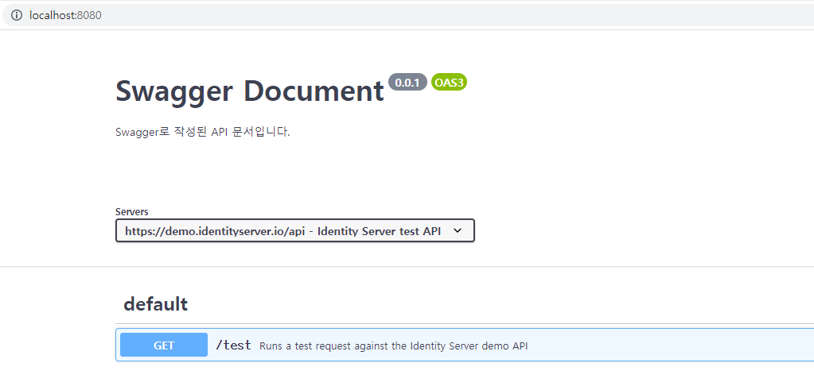
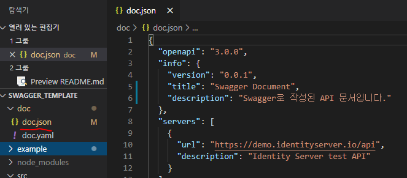

### Swagger Template

별도의 설정이 필요하지 않은 Swagger 템플릿입니다.
#
#### 사용법

전제사항으로 Node.js, NPM과 GIT이 필요합니다.

###
우선 코드를 클론받습니다.
```
git clone https://github.com/myyrakle/swagger_template
```

###
잘 받았다면, 해당 디렉토리로 이동해 종속성 모듈들을 설치합니다.
```
cd ssafy-server-api-doc
npm i
```
###
그리고 시작 명령어만 사용하면 끝입니다.
그러면 wepback을 통해 문서가 웹서버로 실행될 것입니다.
```
npm start
```
##
이렇게 뜨면 성공입니다.


#
작성은 Swagger 문법을 바탕으로 doc.json 파일을 수정하면 됩니다.


#
자세한 문법구조는 공식 사이트나 기타 포스트 등을 참조하길 바랍니다.
https://swagger.io/specification/
